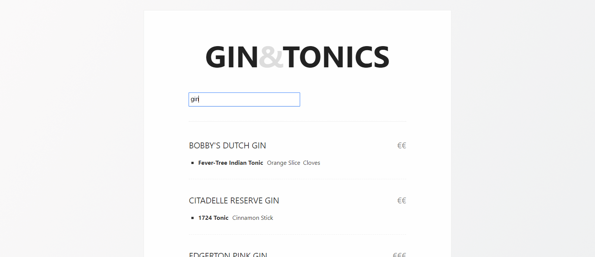

Gin & Tonics shopping list
==========================




* The [recipes.json](src/data/recipes.json5) file is a list of Gin & Tonics that should taste pretty ok. It's definitely a work in progress! Not all recipes get added unfortunately, so some suggestions without extra's/garnishes haven't been "properly" tested yet. Some day (probably soon), I will try something to make the drinks work, but suggestions are very welcome.

* You should probably drink responsibly.


## Contributing

Suggestions for both gin, tonic, and extra garnish are welcome :)


If you want to run it yourself, it is a Vue.js project generated with `vue init webpack-simple`. So you can run it locally with:

``` bash
npm install

npm run dev
```

If you feel anything is missing, you can open an issue with a suggestion or a link. Pull requests are welcome.

